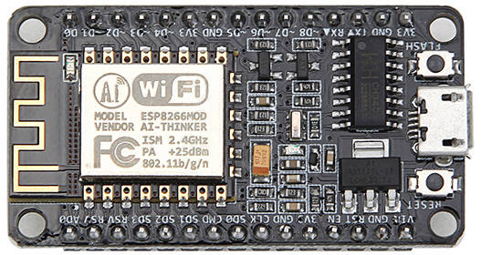

# NOME-DO-PROJETO
lm_esp8266_proj
## Descrição
  Página desenvolvida com intuito de mostrar, de forma bem resumida, as possibilidades de utilização da plataforma _ESP8266_ para monitoramento de variáveis físicas do mundo real, através de uma interface _WEB_. Utilizando para isso _HTML_ para estruturação da exibição do conteúdo pelo navegador _web_, e _CSS_ para estilização do mesmo, bem como a forma de integrar tais recursos no _ESP_ com a utilização da _IDE_ do _ARDUINO_. 
## Objetivo
  Mostrar a simplicidade e versatilidade do uso do _ESP_ na exploração do atual conceito _IoT_ que vem se expandindo com o passar dos anos.
## Inspiração
  A inspiração vem do fato de como algo tão pequeno, porém tão poderoso, poder abarcar um simples _webserver_, e através de uma interface _WEB_ ter a possibilidade de monitorar e/ou executar ações no mundo físico. 
## Protótipos

## Screenshots 
